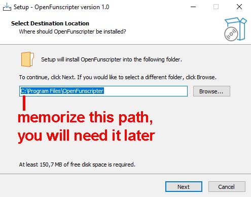
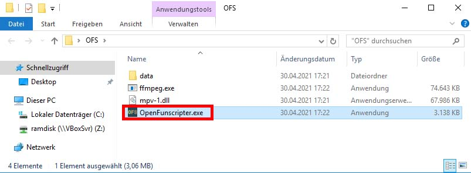

# Open Funscripter Integration

We use a lua script to communicate between the Python Funscript Generator and the Open Funscripter.

## Installation (Windows)

1. Download and install [Open Funscripter (OFS)](https://github.com/OpenFunscripter/OFS/releases). Please memorize the specified installation path, you will need it later.
     
     
2. Download the **latest** packed Python Funscript Editor from [github release page](https://github.com/michael-mueller-git/Python-Funscript-Editor/releases).
     
3. Extract the Archiv.
     
4. Download the **latest** `funscript_generator.lua` script from [github release page](https://github.com/michael-mueller-git/Python-Funscript-Editor/releases).
     
5. Move the downloaded `funscript_generator.lua` script to `data/lua` in your OFS directory. The default OFS install path is `C:\Program Files\OpenFunscripter`.
     
6. Open the `funscript_generator.lua` file and adjust the `Settings.FunscriptGenerator` and `Settings.TmpFile` variable.
     - **NOTE:** If you copy the path from Windows explorer to the variable in the lua script you have to escape the `\` symbol. This mean you have to put another `\` in front of each `\` so that there are always `\\` pairs. As an alternative, you can use a simple `/` instead of the single `\` Symbole that also work.
     - `Settings.FunscriptGenerator`: Point to the extracted **Python Funscript Editor** program (Better double check the complete path string to avoid errors later on. In the past, several people have entered the path to OFS, but it has to be the path to the extracted Python Funscript Editor!).
     - `Settings.TmpFile`: Specifies a temporary file location where to store the result (must be a file not a directory!). The file does not have to exist at the moment. The specified file will be generated from the Python Funscript Editor and will be overwritten automatically at the next time the generator is started!
     
7. Now launch OFS.
     
8. Navigate to `View : Special functions : Custom Functions` and select the `funscript_generator.lua` entry. Click on the `funscript_generator.lua` entry to get more options for the script (This may trigger the funscript generator, just ignore it for now). Finally click the now visible Button `Bind Script`.
     
9. Navigate to `Options : Keys : Dynamic` and insert a shortcut for the funscript generator.
     
10. Now you can use the shortcut at any position in the video to start the funscript generator.

## Troubleshot

If you have problems with the OFS integration setup first test if the app work in standalone mode by starting the `funscript-editor.exe`. This allows the source of the error to be narrowed down more quickly!

If the standalone application works, look for your problem in the issues listed below. If the standalone application not work or your issue was not solved by a point listed below, open an issue with a detailed problem description and the full terminal window output if available.

### After setting the min and max value after tracking no points are inserted in OFS

If the points are missing in OFS then most likely the variable `Settings.TmpFile` in the `funscript_generator.lua` script is set incorrectly or the generator crashes. A crash could happen if your PC does not have enough memory. The amount of memory required depends heavily on the video resolution!

### Noting happens when i press the Shortcut for the Funscript Generator

In most cases, the variable `Settings.FunscriptGenerator` in the `funscript_generator.lua` script was not set correctly.

If you are using an older version of the `funscript_generator.lua` you should download the latest version of the script from the [github release page](https://github.com/michael-mueller-git/Python-Funscript-Editor/releases). With older `funscript_generator.lua` scripts there were e.g. problems with blanks in the path.

**Important:** You have to use use `/` or `\\` for the `\` symbols in your path!

### When calling the generator, only a message box is displayed with the message: "Video file was not specified!"

In some cases OFS does not set the path to the video file within the lua script correctly (the variable `VideoFilePath` is empty). This happen when the video path contains some special character like square braked `[` and `]`. Rename your video files and store them in a path without special character. Then the variable should be set by OFS and the motion tracking funscript generator should work.

### When press shortcut the message "C:\Users\\...” is not recognized as an internal or external command, operable program or batch file appears in the terminal output.

The path you have set in `Settings.FunscriptGenerator` does not exist. You have an typo in the path or forget an parent directory. Double check the complete path string!

### Tracking stops automatically

If a tacker does not find the selected feature in the next frame, the tracking process stops. If more than 120 frames have already been tracked, a window appears to select the minimum and maximum value in which the reason for the abort is displayed with e.g. `Info: Tracker Woman Lost`.

If less than 120 frames have been processed, a message box should pop up with the message `Tracking time insufficient`. In this case, no output is generated because there is not enough data for the algorithm to work with.

### Tracking stops very often

The selection of the tracking feature is tricky and requires some practice and experience. For a good tracking result, unique features in the video should be selected near the desired tacking position.
